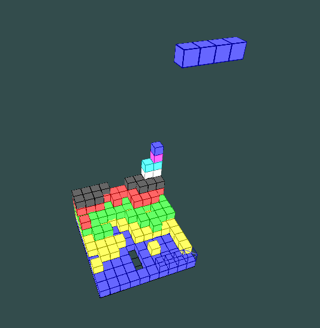

# 3D-tetris

A 3D version of tetris inspired by [Blockout](http://blockout.net/). It has a larger game area, a movable camera to see it from different angles, and a preview of where the next piece is going to land.

## Controls

The current controls aren't final, and are only meant help with observing the game while working on new features. They do make the game playable, however.

Arrow key move the currently falling piece. Holding 1, 2, or 3 while pressing the left or right arrow will rotate it around the axis selected by the number key. Enter instantly drops the current piece.

A and D move the camera around the game field, W and S move it closer and further horizontally, space and left shift move it up and down. Moving the mouse up and down make the camera look up and down.

## Development

The game uses OpenGL and open source libraries. The libraries are handled by vcpkg, the project is built by CMake. The project uses C++20 modules, which might not be supported in all environments.

I'm not actively working on the game, I only updated it to use CMake, vcpkg, and modules. Substantial updates in the near future are unlikely.